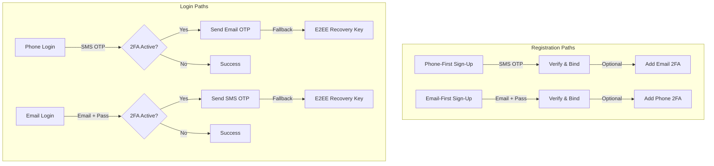

# Implementation Plan: Dual-Path Authentication with MFA & Recovery Fallback

This document outlines the step-by-step technical plan to implement a secure, blazing-fast, and highly resilient dual-path authentication system with Multi-Factor Authentication (MFA) and an E2EE Offline Recovery Key fallback inside ZenChat.

---

## 1. Core Architecture Overview



---

## 2. Database Schema Refinements (`User.js` Model)

To support dual-path authentication, secondary channels, and MFA metadata, we will refine the User Schema:

```javascript
const UserSchema = new mongoose.Schema({
  username: { type: String, required: true },
  
  // Dual-Path Credentials
  phoneNumber: { type: String, unique: true, sparse: true },
  email: { type: String, unique: true, sparse: true },
  passwordHash: { type: String }, // Present only if Email-First registered

  // MFA Controls
  is2faEnabled: { type: Boolean, default: false },
  mfaPreference: { 
    type: String, 
    enum: ['phone', 'email', 'none'], 
    default: 'none' 
  }, // Tells us which channel serves as the secondary factor

  // Active Session Verification Blocks
  verificationSession: {
    otpCode: String,
    otpExpires: Date,
    emailOtpCode: String,
    emailOtpExpires: Date,
    tempJwtToken: String // Keeps session secure between Factor 1 and Factor 2
  },

  // E2EE Key Sync (Existing E2EE System)
  recoveryKeyHash: { type: String, required: true } // Utilized as the ultimate fallback
}, { timestamps: true });
```

---

## 3. Backend Implementation Plan

### Step 3.1: Brevo Transactional Email Integration
We will establish a dedicated utility `server/utils/mailer.js` configured with Brevo's SMTP transport or official REST SDK to dispatch blazing-fast, reliable transactional 2FA codes.

```javascript
import nodemailer from 'nodemailer';

const transporter = nodemailer.createTransport({
  host: 'smtp-relay.brevo.com',
  port: 587,
  auth: {
    user: process.env.BREVO_SMTP_USER,
    pass: process.env.BREVO_SMTP_PASSWORD
  }
});

export const send2faEmail = async (toEmail, code) => {
  const mailOptions = {
    from: '"ZenChat Security" <security@zenchat.app>',
    to: toEmail,
    subject: 'ZenChat Two-Factor Authentication Code',
    html: `
      <div style="font-family: system-ui, -apple-system, sans-serif; background: #0b0f19; color: #ffffff; padding: 24px; border-radius: 12px; max-width: 450px; margin: auto; border: 1px solid rgba(255,255,255,0.06);">
        <h2 style="color: #3da5d9; margin-bottom: 8px;">Verify Your Identity</h2>
        <p style="font-size: 0.9rem; color: rgba(255,255,255,0.7); margin-bottom: 24px;">Please enter the following code on the login screen to complete your session authentication:</p>
        <div style="font-size: 32px; font-weight: 700; letter-spacing: 6px; color: #3da5d9; text-align: center; padding: 12px; background: rgba(61, 165, 217, 0.08); border-radius: 8px; margin-bottom: 24px; font-family: monospace;">
          ${code}
        </div>
        <p style="font-size: 0.75rem; color: rgba(255,255,255,0.4); text-align: center;">This code is valid for 5 minutes. If you did not request this, please change your credentials immediately.</p>
      </div>
    `
  };
  await transporter.sendMail(mailOptions);
};
```

### Step 3.2: Dual-Path Authentication API Routes
We will configure four critical routes in `server/routes/auth.js`:

1. **`POST /api/auth/register/phone` & `/register/email`**
   * Path A: Takes Phone -> Sends SMS OTP.
   * Path B: Takes Email + Password -> Registers. Prompts optional binding for phone SMS verification.
2. **`POST /api/auth/login/phone`**
   * Generates SMS OTP -> Returns session indicator.
3. **`POST /api/auth/login/email`**
   * Validates email/password -> If 2FA enabled, triggers secondary SMS OTP and returns `MFA_REQUIRED`.
4. **`POST /api/auth/verify-secondary` (The Unified Gate)**
   * Validates secondary Email/SMS OTP.
   * **Fallback Route:** Also accepts the `recoveryKey` parameter. If present, it compares the recovery key against `recoveryKeyHash` directly, bypassing the SMS/Email delivery failure securely.

---

## 4. Frontend UI/UX & WebOTP Implementation Plan

### Step 4.1: Responsive Dual-Path Sign-in UI
We will build a high-fidelity Auth Card featuring:
* Tabs to switch between **Phone Sign-In** and **Email Sign-In** with smooth micro-animations.
* Auto-focus OTP inputs (animated boxes).

### Step 4.2: WebOTP API Integration (Mobile Auto-Verification)
We will leverage mobile auto-verification inside the React component:

```javascript
import React, { useEffect, useRef } from 'react';

const OtpInput = ({ onCodeSubmit }) => {
  const inputRef = useRef(null);

  useEffect(() => {
    if (!('OTPCredential' in window)) return;

    const ac = new AbortController();
    navigator.credentials.get({
      otp: { transport: ['sms'] },
      signal: ac.signal
    }).then(otp => {
      if (otp && otp.code) {
        inputRef.current.value = otp.code;
        onCodeSubmit(otp.code); // Submit instantly!
      }
    }).catch(err => {
      console.log('WebOTP auto-verification cancelled or timed out.');
    });

    return () => ac.abort();
  }, [onCodeSubmit]);

  return (
    <input
      ref={inputRef}
      type="text"
      inputMode="numeric"
      pattern="[0-9]*"
      maxLength={6}
      className="otp-field"
      placeholder="000000"
    />
  );
};
```

---

## 5. Security & Fallback Mechanics

> [!IMPORTANT]
> **E2EE Recovery Key Validation Integrity**
> 1. Because the Offline Recovery Key acts as the ultimate fallback, it is **never** transmitted in plain text during registration or fallback login.
> 2. Verification is performed using high-performance cryptographic hashes (`bcrypt` comparison) to guarantee database leaks do not compromise E2EE privacy or credentials.
> 3. Bypassing 2FA with the E2EE key immediately fires an email alert (if an email is bound to the account) to inform the user that their offline key was utilized to gain access.

---

## 6. Implementation Sequence (COMPLETED & VERIFIED)

All phases of the dual-path authentication, MFA secondary factor verification, and PWA/UX improvements have been successfully built, verified, and compiled.

| Phase | Tasks | Status | Target Files |
201: | **Phase 1: Backend Setup** | Add Brevo SMTP, Firebase Admin SDK integration, refactor MongoDB Schema. | **Done** | `server/.env`, `User.js`, `mailer.js` |
202: | **Phase 2: Controller Dev** | Write phone/email controllers, verification logic, and fallback E2EE route. | **Done** | `authController.js`, `auth.js` |
203: | **Phase 3: Frontend Dev** | Create dual-tab auth screens, OTP input, WebOTP integration, and fallback buttons. | **Done** | `LoginPage.jsx`, `RegisterPage.jsx` |
204: | **Phase 4: QA & Push** | Test OTP delivery latency, fallback bypass verification, compile client build. | **Done** | Client tests, Git main push |
205: | **Phase 5: UX & Stability** | Add logout confirmation dialog, PWA browser open nudge, persistent push notifications, visibility presence tracking. | **Done** | `App.jsx`, `Sidebar.jsx`, `InstallPWA.jsx`, `NotificationPrompt.jsx` |

---

## 7. Backwards Compatibility & Existing User Impact

The authentication flow revamp guarantees **zero downtime or disruption** for existing email/password registered accounts through progressive security updates.

### 7.1 Database Index Protection (Sparse Indexes)
By configuring MongoDB properties using sparse parameters:
```javascript
phoneNumber: { type: String, unique: true, sparse: true },
email: { type: String, unique: true, sparse: true }
```
MongoDB ignores missing properties inside unique constraint checks. This permits existing email-only users to have no phone details, and new phone-only accounts to have no email profiles without causing record duplication errors or database failures.

### 7.2 Core User Login Retention
Existing accounts can log in exactly as they did before via the Email Sign-In path. No passwords or account fields will be altered or reset during setup.

### 7.3 Progressive Enrollment Prompt
Once logged in, users can be prompted in their dashboard or profile layout with an opt-in component:
* *"Secure your account with 2FA"*.
* Binding their phone number updates their document state with `phoneNumber` and `is2faEnabled: true`.
* Future logins instantly redirect them into the multi-factor authentication route.

### 7.4 Zero Key Fatigue
Because the offline recovery key acts as the ultimate fallback, the application reuses the **existing E2EE offline recovery key** the user already possesses, ensuring no new credentials or backup passwords need to be created or remembered.
